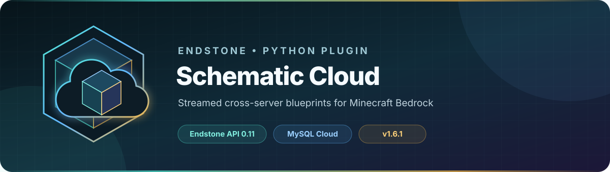
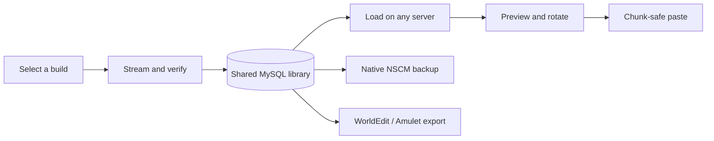

<!-- endstone-professional-header:start -->
<p align="center">
  
</p>

<p align="center">
  <a href="https://github.com/TheNINJALLO/endstone-schematic-cloud/releases/latest"></a>
  <a href="https://github.com/TheNINJALLO/endstone-schematic-cloud/releases"></a>
  <a href="LICENSE"></a>
</p>

<p align="center">
  
  
  
  
  
</p>

<p align="center">
  <strong>Save once. Preview, paste, back up, and export anywhere in your Endstone network.</strong>
</p>

<p align="center">
  <a href="#overview">Overview</a> &bull;
  <a href="#quick-start">Quick start</a> &bull;
  <a href="#how-to-use-it">How to use</a> &bull;
  <a href="#commands">Commands</a> &bull;
  <a href="#configuration">Configuration</a> &bull;
  <a href="#large-schematic-safety">Large builds</a> &bull;
  <a href="https://github.com/TheNINJALLO/endstone-schematic-cloud/releases">Releases</a>
</p>
<!-- endstone-professional-header:end -->

## Overview

Ninj-OS Schematic Cloud is an Endstone plugin for capturing Minecraft Bedrock structures and sharing them through a central MySQL or MariaDB library. Builders can select a region, upload it once, then load, preview, rotate, and paste it on any connected server using commands or in-game forms.

The plugin is designed for large builds:

- Streams large records through temporary files instead of keeping several full copies in memory.
- Stores compressed payloads in packet-safe, checksum-verified database chunks.
- Divides world reads and writes across server ticks.
- Applies a real-time paste budget to protect the Bedrock main thread.
- Holds and verifies each chunk before reading or writing it.
- Supports undo and redo within configurable history limits.
- Retains canonical block-entity NBT and container inventories through the optional BlockData API.
- Continues active world operations if the initiating player disconnects.
- Exports lossless native backups and Sponge Schematic v3 files for WorldEdit or Amulet.



## Quick start

### Requirements

| Component | Supported |
|---|---|
| Endstone API | `0.11` |
| Minecraft Bedrock / BDS | `26.x` |
| Python | `3.10+` |
| Database | MySQL `8.0+` or MariaDB `10.5+` |
| Plugin release | `v1.7.0` |
| Block metadata | Optional matching [`endstone-blockdata`](https://github.com/TheNINJALLO/endstone-blockdata-api) release |

### 1. Download and install

Download the latest wheel from [GitHub Releases](https://github.com/TheNINJALLO/endstone-schematic-cloud/releases/latest), or use the GitHub CLI:

```bash
gh release download v1.7.0 \
  --repo TheNINJALLO/endstone-schematic-cloud \
  --pattern "*.whl"
```

Stop the server, remove every older `endstone_ninjos_schematics-*.whl`, place the new wheel in the top-level `plugins/` directory, and start Endstone once so the default configuration is created.

> [!IMPORTANT]
> Replace the wheel while the server is fully stopped. Do not use `/reload` for wheel upgrades.

### 2. Create the database

Edit the host and password placeholders in [database/create_database_example.sql](database/create_database_example.sql), then run it as a database administrator:

```bash
mysql -u root -p < database/create_database_example.sql
```

The plugin can create and upgrade its own tables when `auto_create_schema = true`; the database account still needs the permissions shown in the example SQL file.

### 3. Configure the connection

Open the generated plugin `config.toml` and set the database connection:

```toml
[database]
host = "10.0.0.25"
port = 3306
user = "schematics"
password = "replace-with-a-strong-password"
database = "ninjos_schematics"
namespace = "global"
table_prefix = "ninjos_"
auto_create_schema = true

[server]
server_id = "survival-1"

[blockdata]
enabled = true
strict_restore = true
max_uncompressed_mb = 64
```

For multiple servers:

- Point every server at the same database.
- Use the same `database.namespace` for servers that should share a library.
- Give every server a unique `server.server_id` for audit metadata.
- Keep database credentials in each server's local configuration, never in Git.

Environment variables can override sensitive connection values:

| Variable | Setting |
|---|---|
| `NINJOS_SCHEM_DB_HOST` | Database host |
| `NINJOS_SCHEM_DB_PORT` | Database port |
| `NINJOS_SCHEM_DB_USER` | Database user |
| `NINJOS_SCHEM_DB_PASSWORD` | Database password |
| `NINJOS_SCHEM_DB_NAME` | Database name |
| `NINJOS_SCHEM_DB_SSL_CA` | CA certificate path |
| `NINJOS_SCHEM_NAMESPACE` | Shared library namespace |

### 4. Verify the installation

Restart Endstone and run:

```text
/schem version
/schem dbtest
/schem status
```

The startup log for this release contains:

```text
Enabled v1.7.0 build=blockdata-nscm-v2-20260904
```

If BlockData is installed, startup also reports its API version and active adapter. `/schem status` shows `BlockData retention: Ready`.

## Access control

Every player-facing action requires either server operator status or the configured scoreboard tag. The default tag is `architect`:

```mcfunction
/tag <player> add architect
/tag <player> remove architect
```

Change it in `config.toml` if your network uses another role:

```toml
[access]
architect_tag = "architect"
denied_message = "Only server operators and players with the architect tag can use Ninj-OS Schematics."
```

The console may run `/schem version` and `/schem dbtest`; placement and library workflows require an authorized in-game player.

## How to use it

The easiest entry point is:

```text
/schem menu
```

The form UI covers selection saving, cloud browsing, placement, undo/redo, diagnostics, tools, and active-job cancellation.

### Save a structure to the cloud

1. Set both selection corners:

   ```text
   /schem pos1
   /schem pos2
   ```

   Running these commands without coordinates uses your current block position. You can also provide exact coordinates, for example `/schem pos1 -32 64 48`.

2. Confirm the selection with `/schem status`.
3. Save it:

   ```text
   /schem save castle-gate true false
   ```

   The optional arguments are `include_air` and `overwrite`.

   - `include_air = true` stores the complete selected volume. When pasted, saved air clears destination blocks.
   - `include_air = false` creates a sparse schematic and leaves unspecified destination blocks untouched.
   - `overwrite = true` replaces an existing cloud entry with the same normalized name.

4. Watch `/schem status` while the selection is scanned, compressed, uploaded, and verified.

Schematic names normalize to lowercase and may contain letters, numbers, dots, underscores, and dashes. Names are limited to 64 characters.

### Load, position, and paste a structure

1. Browse the shared library:

   ```text
   /schem list
   /schem list castle
   ```

2. Download a schematic:

   ```text
   /schem load castle-gate
   ```

3. Move and rotate the preview:

   ```text
   /schem anchor
   /schem rotate cw
   /schem preview
   ```

   `/schem anchor` uses your current position. Exact coordinates are also supported.

4. Review the confirmation screen with `/schem paste`.
5. Start the paste with `/schem confirm`.
6. Use `/schem status` to monitor progress. Use `/schem cancel` to stop the job or `/schem undo` after completion.

> [!NOTE]
> Paste, undo, and redo jobs continue if the initiating player disconnects. Reconnect with the same account to view status or cancel the operation.

### Retain block-entity data with BlockData

Install the native plugin and matching platform/Python bridge from the same [`endstone-blockdata`](https://github.com/TheNINJALLO/endstone-blockdata-api/releases) release as the running BDS and Endstone build. Restart the server; do not mix bridge and native-plugin versions.

When the live `endstone:blockdata:v2` service is available, a cloud save captures coordinate-free canonical actor NBT and occupied container slots into the sparse NSCM v2 metadata section. Paste performs these operations on the primary thread:

1. Capture destination metadata for undo.
2. Place and verify the base block and states.
3. Restore supported actor NBT through a force patch.
4. Restore occupied items and explicitly clear every empty container slot.
5. Capture the result for redo history.

Typed NBT byte, short, long, and float values are preserved. Metadata coordinates rotate with their blocks. `strict_restore = true` stops on the first metadata failure and retains a partial undo instead of reporting a silently incomplete paste.

The integration is optional for ordinary blocks. If it is unavailable, block types and states still save and paste normally. A schematic that actually contains retained metadata requires BlockData on the destination while strict restoration is enabled.

> [!IMPORTANT]
> NSCM v1 cloud rows and backups remain readable in v1.7.0. New saves use NSCM v2; update every connected schematic server before sharing newly saved v2 entries.

### Use the optional in-game tools

Activate both packs from `addon/` on the world, then run:

```text
/schem tools
```

| Tool | Interaction |
|---|---|
| Selection Wand | Left-click a block for position 1; right-click for position 2 |
| Placement Anchor | Right-click a block to move the loaded schematic |
| Rotator | Right-click to rotate the current placement clockwise |
| Cloud Tablet | Right-click to open the main menu |
| Undo Tool | Right-click to undo |
| Redo Tool | Right-click to redo |
| Confirm Tool | Right-click to confirm the current paste |

Commands remain available if you choose not to install the add-on packs.

### Back up or export a cloud schematic

Native backups preserve the exact cloud payload:

```text
/schem export castle-gate
```

WorldEdit and Amulet exports use Sponge Schematic v3:

```text
/schem export-worldedit castle-gate
```

| Format | Extension | Intended use |
|---|---|---|
| Native NSCM | `.nscm` | Lossless Ninj-OS backup and database-level recovery |
| Sponge Schematic v3 | `.schem` | Modern WorldEdit and Amulet workflows |

The Sponge exporter preserves dimensions, the block palette, mapped states, author metadata, source server, and origin. Native `.nscm` backups retain the BlockData sidecar exactly. Sponge v3 conversion does not currently translate that Bedrock actor data, so container inventories, sign text, command-block commands, lectern books, spawner data, entities, and biomes are not exported to `.schem`.

> [!CAUTION]
> `/schem remove` permanently deletes a cloud row and its payload for every connected server. Prefer `/schem backup-remove` when a recoverable native copy is required. `/schem archive` hides an entry without deleting its database row.

## Commands

All aliases reach the same centralized operator-or-architect access check.

See [commands.md](commands.md) for the dedicated command reference, argument rules, aliases, examples, and recommended workflows.

### Selection and menu

| Command | What it does |
|---|---|
| `/schem menu` | Opens the main form UI. Aliases: `ui`, `form` |
| `/schem pos1 [x y z]` | Sets selection corner one. Alias: `p1` |
| `/schem pos2 [x y z]` | Sets selection corner two. Alias: `p2` |
| `/schem selection` | Displays selection and job status. Alias: `sel` |
| `/schem clearselection` | Clears the current selection and outline. Alias: `clearsel` |
| `/schem tools` | Gives the optional add-on tools |

### Cloud library and storage

| Command | What it does |
|---|---|
| `/schem save <name> [include_air] [overwrite]` | Scans and uploads the current selection |
| `/schem list [search]` | Browses or searches active cloud entries. Alias: `browse` |
| `/schem load <name>` | Downloads, validates, and previews a cloud schematic |
| `/schem export <name> [overwrite]` | Writes a native `.nscm` backup. Aliases: `download`, `disk-save` |
| `/schem export-worldedit <name> [overwrite]` | Writes a Sponge v3 `.schem`. Aliases: `worldedit`, `amulet`, `sponge-v3` |
| `/schem diskpath` | Displays the configured native backup directory |
| `/schem worldeditpath` | Displays the configured Sponge export directory |
| `/schem backup-remove <name> [overwrite]` | Verifies a native backup, then permanently removes the MySQL entry. Alias: `export-remove` |
| `/schem remove <name>` | Permanently removes an entry and its payload. Alias: `delete` |
| `/schem archive <name>` | Hides an entry while retaining its database row |

### Placement and history

| Command | What it does |
|---|---|
| `/schem anchor [x y z]` | Moves the loaded schematic anchor; defaults to your position |
| `/schem rotate [0\|90\|180\|270\|cw\|ccw]` | Sets or changes placement rotation |
| `/schem preview` | Refreshes the particle bounding box |
| `/schem paste` | Opens placement confirmation. Alias: `place` |
| `/schem confirm` | Builds the paste plan and begins placement. Alias: `commit` |
| `/schem undo` | Reverts the last completed or recorded partial paste |
| `/schem redo` | Reapplies the last undone paste |
| `/schem cancel` | Cancels the active scan, preparation, paste, or preview |

### Diagnostics

| Command | What it does | Console |
|---|---|:---:|
| `/schem status` | Shows database, storage, selection, placement, history, and job status | No |
| `/schem dbtest` | Tests the configured MySQL/MariaDB connection | Yes |
| `/schem version` | Shows the loaded version, build ID, and module path. Alias: `ver` | Yes |
| `/schem help` | Displays command help. Alias: `?` | No |

## Configuration

The packaged [config.toml](src/endstone_ninjos_schematics/config.toml) is the complete reference. Existing runtime files are merged with newly introduced defaults without replacing administrator values.

| Section | Controls |
|---|---|
| `[database]` | Connection, namespace, payload chunking, retries, timeouts, TLS, and schema creation |
| `[server]` | Unique source-server identifier |
| `[disk]` | Native `.nscm` backup location and limits |
| `[worldedit]` | Sponge v3 export location, Java data version, and reports |
| `[access]` | Operator-or-scoreboard-tag authorization |
| `[performance]` | Scan/paste budgets, chunk loading, physics, verification, and progress |
| `[streaming]` | Spill threshold, temporary workspace, disk reserve, and cleanup |
| `[schematics]` | Default air and overwrite choices |
| `[placement]` | Missing custom-block behavior |
| `[preview]` | Selection and placement particles |
| `[history]` | Undo/redo operation and block limits |
| `[blockdata]` | Optional actor/container capture, strict restoration, and metadata memory limit |
| `[tools]` | Custom item identifiers and interaction debounce |

### Missing custom blocks

A cloud schematic may reference a custom block that is not registered on the destination server:

```toml
[placement]
missing_block_policy = "skip"
missing_block_fallback = "minecraft:stone"
missing_block_report_limit = 20
```

Available policies:

- `skip`: leave the destination block unchanged.
- `air`: substitute air.
- `fallback`: use `missing_block_fallback`.
- `abort`: stop on the first missing block.

Exact restoration requires the same behavior packs and block identifiers on source and destination servers.

## Large schematic safety

v1.7.0 retains the v1.6 watchdog protections: long-running pastes have both a record limit and a wall-clock limit.

```toml
[performance]
scan_blocks_per_tick = 2500
paste_blocks_per_tick = 1200
paste_time_budget_ms = 10
max_blocks_per_schematic = 2000000
apply_physics = false
skip_unchanged_blocks = true
auto_load_missing_chunks = true
chunk_load_timeout_ticks = 1200
chunk_stabilize_ticks = 4
verify_paste_writes = true
max_paste_failures = 0
```

Paste work yields when either `paste_blocks_per_tick` or `paste_time_budget_ms` is reached. The time limit prevents state-heavy or slow chunks from monopolizing a server tick even when fewer than 1,200 records were processed.

Newer Endstone runtimes use native chunk loading and deferred release. Older API 0.11 runtimes fall back to temporary preloaded ticking areas:

```toml
[performance]
legacy_tickingarea_fallback = true
legacy_tickingarea_preload = true
legacy_tickingarea_max_active = 8
```

Bedrock permits at most ten ticking areas per world, so the default leaves two slots for administrators. Cheats must be enabled when this legacy fallback is required.

### Temporary workspace capacity

Each stored record uses 16 bytes before compression. Large operations spill to disk:

```toml
[streaming]
enabled = true
memory_spill_threshold_mb = 8
plan_batch_records = 32768
temp_directory = "streaming_work"
max_temp_workspace_mb = 16384
minimum_free_disk_mb = 1024
cleanup_orphans_on_startup = true
```

Approximate temporary-space planning:

- Save: about 32 bytes per selected block plus 64 MiB.
- Load/paste without undo: about 32 bytes per stored record plus the compressed payload.
- Load/paste with undo: about 64 bytes per stored record plus the compressed payload.

Undo is automatically disabled for an individual paste above `history.max_blocks_per_operation`. Raise that limit only when the temporary disk has room for both before and after streams.

## Troubleshooting

### Database reports unavailable

1. Run `/schem dbtest`.
2. Confirm the host, port, database, user, and namespace.
3. Verify firewall access from the Minecraft server to the database.
4. Confirm the account has the permissions from `database/create_database_example.sql`.
5. For TLS connections, verify `ssl_ca` or `NINJOS_SCHEM_DB_SSL_CA`.

### A chunk will not load

- Keep `auto_load_missing_chunks = true`.
- Increase `chunk_load_timeout_ticks` for slow storage or newly generated areas.
- On older Endstone builds, enable cheats and confirm the console can run `/tickingarea`.
- Avoid consuming all ten Bedrock ticking-area slots with unrelated systems.

### Large paste performance

- Keep `paste_time_budget_ms = 10` as the first safety setting.
- Do not raise both paste limits aggressively on a production server.
- Leave physics disabled for bulk placement unless block-update behavior is required.
- Place the streaming workspace on fast local storage with adequate free space.
- Use `/schem status` to distinguish preparation, chunk waiting, and active placement.

### A custom block is skipped

Install the same behavior pack used by the source server, or select an intentional `missing_block_policy`. The completion message and server log report unavailable identifiers.

### BlockData retention is unavailable

- Install the native BlockData plugin and its matching platform-specific CPython bridge from one release bundle.
- Match that bundle to the exact BDS and Endstone versions shown in the BlockData release.
- Fully restart instead of using `/reload`.
- Check the startup warning and `/schem status` for the rejected bridge version, missing service, or unsupported adapter capability.
- Keep `strict_restore = true` when incomplete container or actor restoration is unacceptable.

## Upgrading

See [INSTALL.md](INSTALL.md) for the clean wheel-upgrade procedure and capacity guidance. Keep the existing plugin data directory and database, but remove old wheel and cached package copies before starting the new version.

## Development

Run the test suite:

```bash
python -m pytest -q
```

Build the wheel:

```bash
python -m build --wheel
```

The current release passes 72 automated tests covering NSCM v1/v2 compatibility, typed BlockData NBT, bounded save capture, container restoration, strict metadata failures, codec integrity, database chunking, streaming records, bounded-memory planning, rotation, chunk residency, write verification, metadata-aware history, exports, disconnect-safe jobs, and watchdog-safe paste yielding.

## License

Released under the [MIT License](LICENSE).
